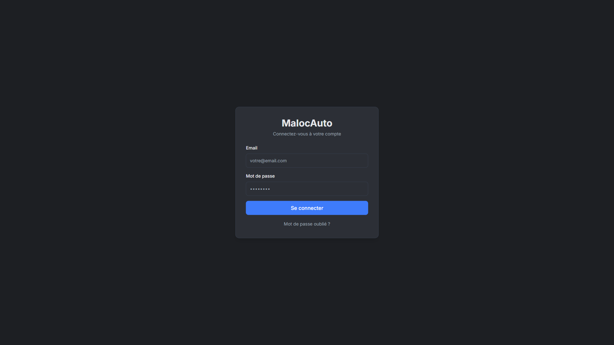
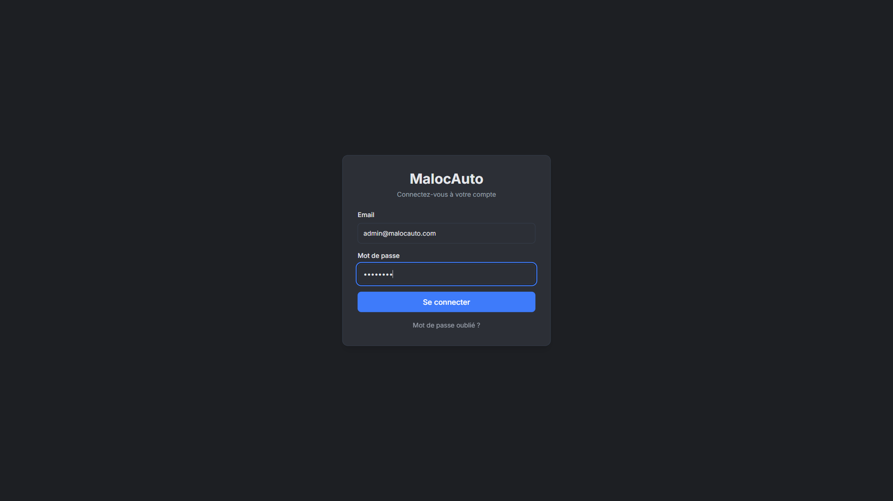
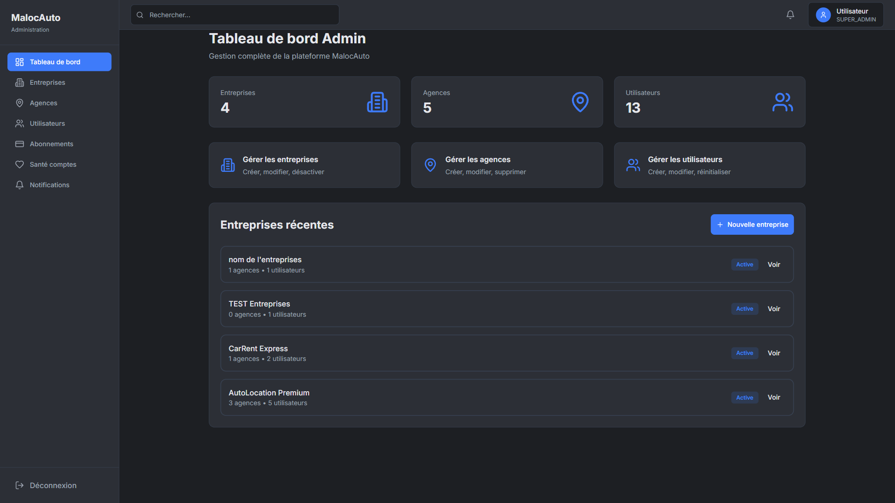

# MALOC - Catalogue Visuel Client

Date: 2026-03-09

## Objectif

Document de presentation client, non technique, focalise sur les ecrans. Il montre les modules et composants visibles de l'application par version.

## Chiffres cles de la galerie

- Captures web integrees: **48**
- Sequence connexion integree: **4**
- Format: lecture simple, une capture = un ecran/module

## 1) Espace Public (authentification)

### 1.1 01 01 Login Page Initial

### 1.2 02 02 Email Entered

### 1.3 03 03 Password Entered

### 1.4 04 04 After Submit Click

## 2) Version Admin

### 2.1 Admin

### 2.2 Admin Agencies

### 2.3 Admin Agencies New

### 2.4 Admin Companies

### 2.5 Admin Companies New Validated

### 2.6 Admin Companies New

### 2.7 Admin Company Health

### 2.8 Admin Notifications

### 2.9 Admin Plans

### 2.10 Admin Profile

### 2.11 Admin Settings

### 2.12 Admin Subscriptions

### 2.13 Admin Users

### 2.14 Admin Users New

## 3) Version Company

### 3.1 Company

### 3.2 Company Agencies

### 3.3 Company Agencies New

### 3.4 Company Analytics

### 3.5 Company Notifications

### 3.6 Company Planning

### 3.7 Company Profile

### 3.8 Company Users

### 3.9 Company Users New

## 4) Version Agence

### 4.1 Agency

### 4.2 Agency Bookings

### 4.3 Agency Bookings New

### 4.4 Agency Charges

### 4.5 Agency Clients

### 4.6 Agency Clients New

### 4.7 Agency Contracts

### 4.8 Agency Fines

### 4.9 Agency Fines New

### 4.10 Agency Gps Kpi

### 4.11 Agency Gps

### 4.12 Agency Invoices

### 4.13 Agency Journal

### 4.14 Agency Kpi

### 4.15 Agency Maintenance

### 4.16 Agency Maintenance New

### 4.17 Agency Notifications

### 4.18 Agency Planning

### 4.19 Agency Profile

### 4.20 Agency Vehicles

### 4.21 Agency Vehicles New

## 5) Version Mobile (Agent)

Captures mobiles a completer avec device reel (Android/iOS) pour les ecrans:

- Login
- Liste des reservations
- Detail reservation
- Check-in
- Check-out
- Parametres

## Annexes visuelles

- Dossier captures web: `docs/evidence/web-local-html/`
- Dossier captures login: `test-screenshots-login-3100/`
- Ce document est volontairement non technique pour usage client/commercial.
