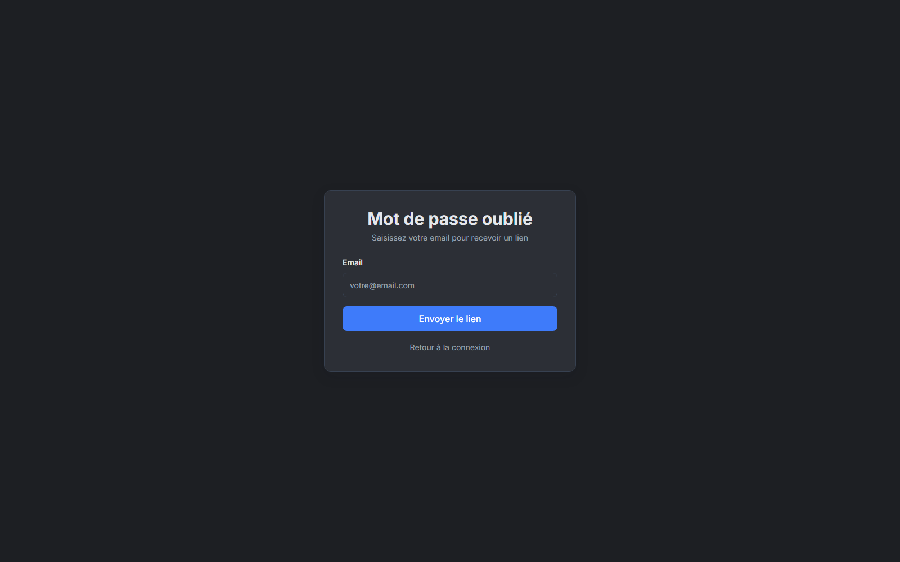
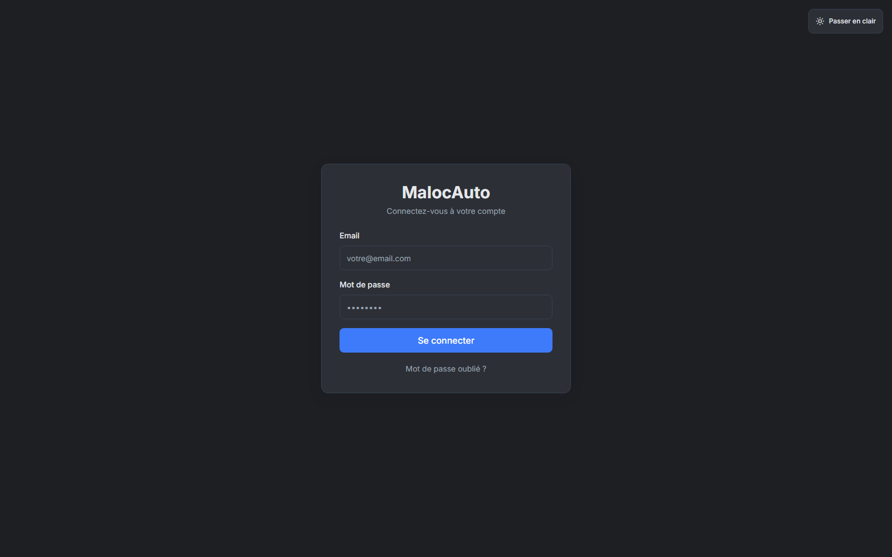
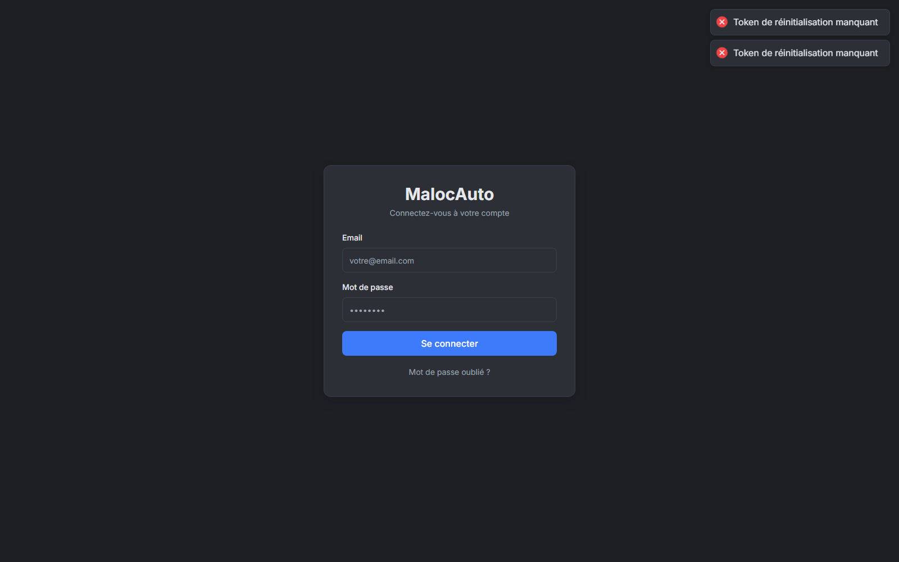
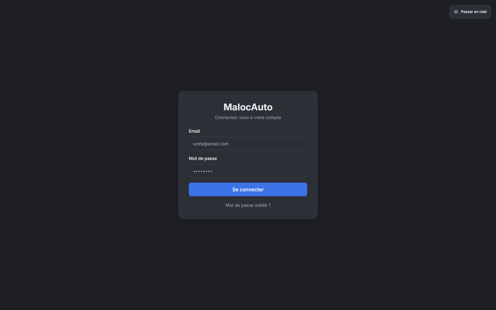

# MALOC - Presentation Client (Toutes Versions)

Date: 2026-03-09

## Objectif du document

Ce document est volontairement simple et non technique. Il montre les ecrans de l'application MALOC par type d'utilisateur, avec une presentation claire orientee metier.

## Couverture visuelle

- Captures live integrees: **92**
- Versions couvertes: Public, Admin, Company, Agence Manager, Agent.
- Focus: ecrans, modules, parcours utilisateur.

## Lecture rapide de la valeur

- Version Admin: pilotage global de la plateforme SAAS.
- Version Company: gouvernance de l'entreprise et de ses agences.
- Version Agence: operations quotidiennes et performance locale.
- Version Agent: execution terrain rapide et guidee.

## 1) Version Publique

Nombre d'ecrans presentes: **4**

### 1.1 Mot de passe oublie

Description client:
- Cet ecran fait partie du module **Mot de passe oublie**.
- Il permet une utilisation simple, rapide et orientee resultat.
- L'interface privilegie la clarte pour reduire les erreurs.

### 1.2 Accueil

Description client:
- Cet ecran fait partie du module **Accueil**.
- Il permet une utilisation simple, rapide et orientee resultat.
- L'interface privilegie la clarte pour reduire les erreurs.

### 1.3 Connexion

Description client:
- Cet ecran fait partie du module **Connexion**.
- Il permet une utilisation simple, rapide et orientee resultat.
- L'interface privilegie la clarte pour reduire les erreurs.

### 1.4 Reinitialisation mot de passe

Description client:
- Cet ecran fait partie du module **Reinitialisation mot de passe**.
- Il permet une utilisation simple, rapide et orientee resultat.
- L'interface privilegie la clarte pour reduire les erreurs.

## 2) Version Admin (Super Admin)

Nombre d'ecrans presentes: **33**

### 2.1 Dashboard Admin

Description client:
- Cet ecran fait partie du module **Dashboard Admin**.
- Il permet une utilisation simple, rapide et orientee resultat.
- L'interface privilegie la clarte pour reduire les erreurs.

### 2.2 Gestion des agences

Description client:
- Cet ecran fait partie du module **Gestion des agences**.
- Il permet une utilisation simple, rapide et orientee resultat.
- L'interface privilegie la clarte pour reduire les erreurs.

### 2.3 Gestion des entreprises

Description client:
- Cet ecran fait partie du module **Gestion des entreprises**.
- Il permet une utilisation simple, rapide et orientee resultat.
- L'interface privilegie la clarte pour reduire les erreurs.

### 2.4 Sante des entreprises

Description client:
- Cet ecran fait partie du module **Sante des entreprises**.
- Il permet une utilisation simple, rapide et orientee resultat.
- L'interface privilegie la clarte pour reduire les erreurs.

### 2.5 Notifications globales

Description client:
- Cet ecran fait partie du module **Notifications globales**.
- Il permet une utilisation simple, rapide et orientee resultat.
- L'interface privilegie la clarte pour reduire les erreurs.

### 2.6 Gestion des offres

Description client:
- Cet ecran fait partie du module **Gestion des offres**.
- Il permet une utilisation simple, rapide et orientee resultat.
- L'interface privilegie la clarte pour reduire les erreurs.

### 2.7 Profil administrateur

Description client:
- Cet ecran fait partie du module **Profil administrateur**.
- Il permet une utilisation simple, rapide et orientee resultat.
- L'interface privilegie la clarte pour reduire les erreurs.

### 2.8 Parametres plateforme

Description client:
- Cet ecran fait partie du module **Parametres plateforme**.
- Il permet une utilisation simple, rapide et orientee resultat.
- L'interface privilegie la clarte pour reduire les erreurs.

### 2.9 Gestion des abonnements

Description client:
- Cet ecran fait partie du module **Gestion des abonnements**.
- Il permet une utilisation simple, rapide et orientee resultat.
- L'interface privilegie la clarte pour reduire les erreurs.

### 2.10 Gestion des utilisateurs

Description client:
- Cet ecran fait partie du module **Gestion des utilisateurs**.
- Il permet une utilisation simple, rapide et orientee resultat.
- L'interface privilegie la clarte pour reduire les erreurs.

### 2.11 Dashboard agence

Description client:
- Cet ecran fait partie du module **Dashboard agence**.
- Il permet une utilisation simple, rapide et orientee resultat.
- L'interface privilegie la clarte pour reduire les erreurs.

### 2.12 Reservations

Description client:
- Cet ecran fait partie du module **Reservations**.
- Il permet une utilisation simple, rapide et orientee resultat.
- L'interface privilegie la clarte pour reduire les erreurs.

### 2.13 Charges et depenses

Description client:
- Cet ecran fait partie du module **Charges et depenses**.
- Il permet une utilisation simple, rapide et orientee resultat.
- L'interface privilegie la clarte pour reduire les erreurs.

### 2.14 Clients

Description client:
- Cet ecran fait partie du module **Clients**.
- Il permet une utilisation simple, rapide et orientee resultat.
- L'interface privilegie la clarte pour reduire les erreurs.

### 2.15 Contrats

Description client:
- Cet ecran fait partie du module **Contrats**.
- Il permet une utilisation simple, rapide et orientee resultat.
- L'interface privilegie la clarte pour reduire les erreurs.

### 2.16 Amendes

Description client:
- Cet ecran fait partie du module **Amendes**.
- Il permet une utilisation simple, rapide et orientee resultat.
- L'interface privilegie la clarte pour reduire les erreurs.

### 2.17 KPI GPS

Description client:
- Cet ecran fait partie du module **KPI GPS**.
- Il permet une utilisation simple, rapide et orientee resultat.
- L'interface privilegie la clarte pour reduire les erreurs.

### 2.18 Suivi GPS

Description client:
- Cet ecran fait partie du module **Suivi GPS**.
- Il permet une utilisation simple, rapide et orientee resultat.
- L'interface privilegie la clarte pour reduire les erreurs.

### 2.19 Factures

Description client:
- Cet ecran fait partie du module **Factures**.
- Il permet une utilisation simple, rapide et orientee resultat.
- L'interface privilegie la clarte pour reduire les erreurs.

### 2.20 Journal d'activite

Description client:
- Cet ecran fait partie du module **Journal d'activite**.
- Il permet une utilisation simple, rapide et orientee resultat.
- L'interface privilegie la clarte pour reduire les erreurs.

### 2.21 KPI de pilotage

Description client:
- Cet ecran fait partie du module **KPI de pilotage**.
- Il permet une utilisation simple, rapide et orientee resultat.
- L'interface privilegie la clarte pour reduire les erreurs.

### 2.22 Maintenance

Description client:
- Cet ecran fait partie du module **Maintenance**.
- Il permet une utilisation simple, rapide et orientee resultat.
- L'interface privilegie la clarte pour reduire les erreurs.

### 2.23 Notifications agence

Description client:
- Cet ecran fait partie du module **Notifications agence**.
- Il permet une utilisation simple, rapide et orientee resultat.
- L'interface privilegie la clarte pour reduire les erreurs.

### 2.24 Planning agence

Description client:
- Cet ecran fait partie du module **Planning agence**.
- Il permet une utilisation simple, rapide et orientee resultat.
- L'interface privilegie la clarte pour reduire les erreurs.

### 2.25 Profil utilisateur

Description client:
- Cet ecran fait partie du module **Profil utilisateur**.
- Il permet une utilisation simple, rapide et orientee resultat.
- L'interface privilegie la clarte pour reduire les erreurs.

### 2.26 Vehicules

Description client:
- Cet ecran fait partie du module **Vehicules**.
- Il permet une utilisation simple, rapide et orientee resultat.
- L'interface privilegie la clarte pour reduire les erreurs.

### 2.27 Dashboard entreprise

Description client:
- Cet ecran fait partie du module **Dashboard entreprise**.
- Il permet une utilisation simple, rapide et orientee resultat.
- L'interface privilegie la clarte pour reduire les erreurs.

### 2.28 Agences de l'entreprise

Description client:
- Cet ecran fait partie du module **Agences de l'entreprise**.
- Il permet une utilisation simple, rapide et orientee resultat.
- L'interface privilegie la clarte pour reduire les erreurs.

### 2.29 Analyse et performance

Description client:
- Cet ecran fait partie du module **Analyse et performance**.
- Il permet une utilisation simple, rapide et orientee resultat.
- L'interface privilegie la clarte pour reduire les erreurs.

### 2.30 Notifications entreprise

Description client:
- Cet ecran fait partie du module **Notifications entreprise**.
- Il permet une utilisation simple, rapide et orientee resultat.
- L'interface privilegie la clarte pour reduire les erreurs.

### 2.31 Planning entreprise

Description client:
- Cet ecran fait partie du module **Planning entreprise**.
- Il permet une utilisation simple, rapide et orientee resultat.
- L'interface privilegie la clarte pour reduire les erreurs.

### 2.32 Profil entreprise

Description client:
- Cet ecran fait partie du module **Profil entreprise**.
- Il permet une utilisation simple, rapide et orientee resultat.
- L'interface privilegie la clarte pour reduire les erreurs.

### 2.33 Utilisateurs de l'entreprise

Description client:
- Cet ecran fait partie du module **Utilisateurs de l'entreprise**.
- Il permet une utilisation simple, rapide et orientee resultat.
- L'interface privilegie la clarte pour reduire les erreurs.

## 3) Version Company (Direction Entreprise)

Nombre d'ecrans presentes: **23**

### 3.1 Dashboard agence

Description client:
- Cet ecran fait partie du module **Dashboard agence**.
- Il permet une utilisation simple, rapide et orientee resultat.
- L'interface privilegie la clarte pour reduire les erreurs.

### 3.2 Reservations

Description client:
- Cet ecran fait partie du module **Reservations**.
- Il permet une utilisation simple, rapide et orientee resultat.
- L'interface privilegie la clarte pour reduire les erreurs.

### 3.3 Charges et depenses

Description client:
- Cet ecran fait partie du module **Charges et depenses**.
- Il permet une utilisation simple, rapide et orientee resultat.
- L'interface privilegie la clarte pour reduire les erreurs.

### 3.4 Clients

Description client:
- Cet ecran fait partie du module **Clients**.
- Il permet une utilisation simple, rapide et orientee resultat.
- L'interface privilegie la clarte pour reduire les erreurs.

### 3.5 Contrats

Description client:
- Cet ecran fait partie du module **Contrats**.
- Il permet une utilisation simple, rapide et orientee resultat.
- L'interface privilegie la clarte pour reduire les erreurs.

### 3.6 Amendes

Description client:
- Cet ecran fait partie du module **Amendes**.
- Il permet une utilisation simple, rapide et orientee resultat.
- L'interface privilegie la clarte pour reduire les erreurs.

### 3.7 KPI GPS

Description client:
- Cet ecran fait partie du module **KPI GPS**.
- Il permet une utilisation simple, rapide et orientee resultat.
- L'interface privilegie la clarte pour reduire les erreurs.

### 3.8 Suivi GPS

Description client:
- Cet ecran fait partie du module **Suivi GPS**.
- Il permet une utilisation simple, rapide et orientee resultat.
- L'interface privilegie la clarte pour reduire les erreurs.

### 3.9 Factures

Description client:
- Cet ecran fait partie du module **Factures**.
- Il permet une utilisation simple, rapide et orientee resultat.
- L'interface privilegie la clarte pour reduire les erreurs.

### 3.10 Journal d'activite

Description client:
- Cet ecran fait partie du module **Journal d'activite**.
- Il permet une utilisation simple, rapide et orientee resultat.
- L'interface privilegie la clarte pour reduire les erreurs.

### 3.11 KPI de pilotage

Description client:
- Cet ecran fait partie du module **KPI de pilotage**.
- Il permet une utilisation simple, rapide et orientee resultat.
- L'interface privilegie la clarte pour reduire les erreurs.

### 3.12 Maintenance

Description client:
- Cet ecran fait partie du module **Maintenance**.
- Il permet une utilisation simple, rapide et orientee resultat.
- L'interface privilegie la clarte pour reduire les erreurs.

### 3.13 Notifications agence

Description client:
- Cet ecran fait partie du module **Notifications agence**.
- Il permet une utilisation simple, rapide et orientee resultat.
- L'interface privilegie la clarte pour reduire les erreurs.

### 3.14 Planning agence

Description client:
- Cet ecran fait partie du module **Planning agence**.
- Il permet une utilisation simple, rapide et orientee resultat.
- L'interface privilegie la clarte pour reduire les erreurs.

### 3.15 Profil utilisateur

Description client:
- Cet ecran fait partie du module **Profil utilisateur**.
- Il permet une utilisation simple, rapide et orientee resultat.
- L'interface privilegie la clarte pour reduire les erreurs.

### 3.16 Vehicules

Description client:
- Cet ecran fait partie du module **Vehicules**.
- Il permet une utilisation simple, rapide et orientee resultat.
- L'interface privilegie la clarte pour reduire les erreurs.

### 3.17 Dashboard entreprise

Description client:
- Cet ecran fait partie du module **Dashboard entreprise**.
- Il permet une utilisation simple, rapide et orientee resultat.
- L'interface privilegie la clarte pour reduire les erreurs.

### 3.18 Agences de l'entreprise

Description client:
- Cet ecran fait partie du module **Agences de l'entreprise**.
- Il permet une utilisation simple, rapide et orientee resultat.
- L'interface privilegie la clarte pour reduire les erreurs.

### 3.19 Analyse et performance

Description client:
- Cet ecran fait partie du module **Analyse et performance**.
- Il permet une utilisation simple, rapide et orientee resultat.
- L'interface privilegie la clarte pour reduire les erreurs.

### 3.20 Notifications entreprise

Description client:
- Cet ecran fait partie du module **Notifications entreprise**.
- Il permet une utilisation simple, rapide et orientee resultat.
- L'interface privilegie la clarte pour reduire les erreurs.

### 3.21 Planning entreprise

Description client:
- Cet ecran fait partie du module **Planning entreprise**.
- Il permet une utilisation simple, rapide et orientee resultat.
- L'interface privilegie la clarte pour reduire les erreurs.

### 3.22 Profil entreprise

Description client:
- Cet ecran fait partie du module **Profil entreprise**.
- Il permet une utilisation simple, rapide et orientee resultat.
- L'interface privilegie la clarte pour reduire les erreurs.

### 3.23 Utilisateurs de l'entreprise

Description client:
- Cet ecran fait partie du module **Utilisateurs de l'entreprise**.
- Il permet une utilisation simple, rapide et orientee resultat.
- L'interface privilegie la clarte pour reduire les erreurs.

## 4) Version Agence (Manager)

Nombre d'ecrans presentes: **16**

### 4.1 Dashboard agence

Description client:
- Cet ecran fait partie du module **Dashboard agence**.
- Il permet une utilisation simple, rapide et orientee resultat.
- L'interface privilegie la clarte pour reduire les erreurs.

### 4.2 Reservations

Description client:
- Cet ecran fait partie du module **Reservations**.
- Il permet une utilisation simple, rapide et orientee resultat.
- L'interface privilegie la clarte pour reduire les erreurs.

### 4.3 Charges et depenses

Description client:
- Cet ecran fait partie du module **Charges et depenses**.
- Il permet une utilisation simple, rapide et orientee resultat.
- L'interface privilegie la clarte pour reduire les erreurs.

### 4.4 Clients

Description client:
- Cet ecran fait partie du module **Clients**.
- Il permet une utilisation simple, rapide et orientee resultat.
- L'interface privilegie la clarte pour reduire les erreurs.

### 4.5 Contrats

Description client:
- Cet ecran fait partie du module **Contrats**.
- Il permet une utilisation simple, rapide et orientee resultat.
- L'interface privilegie la clarte pour reduire les erreurs.

### 4.6 Amendes

Description client:
- Cet ecran fait partie du module **Amendes**.
- Il permet une utilisation simple, rapide et orientee resultat.
- L'interface privilegie la clarte pour reduire les erreurs.

### 4.7 KPI GPS

Description client:
- Cet ecran fait partie du module **KPI GPS**.
- Il permet une utilisation simple, rapide et orientee resultat.
- L'interface privilegie la clarte pour reduire les erreurs.

### 4.8 Suivi GPS

Description client:
- Cet ecran fait partie du module **Suivi GPS**.
- Il permet une utilisation simple, rapide et orientee resultat.
- L'interface privilegie la clarte pour reduire les erreurs.

### 4.9 Factures

Description client:
- Cet ecran fait partie du module **Factures**.
- Il permet une utilisation simple, rapide et orientee resultat.
- L'interface privilegie la clarte pour reduire les erreurs.

### 4.10 Journal d'activite

Description client:
- Cet ecran fait partie du module **Journal d'activite**.
- Il permet une utilisation simple, rapide et orientee resultat.
- L'interface privilegie la clarte pour reduire les erreurs.

### 4.11 KPI de pilotage

Description client:
- Cet ecran fait partie du module **KPI de pilotage**.
- Il permet une utilisation simple, rapide et orientee resultat.
- L'interface privilegie la clarte pour reduire les erreurs.

### 4.12 Maintenance

Description client:
- Cet ecran fait partie du module **Maintenance**.
- Il permet une utilisation simple, rapide et orientee resultat.
- L'interface privilegie la clarte pour reduire les erreurs.

### 4.13 Notifications agence

Description client:
- Cet ecran fait partie du module **Notifications agence**.
- Il permet une utilisation simple, rapide et orientee resultat.
- L'interface privilegie la clarte pour reduire les erreurs.

### 4.14 Planning agence

Description client:
- Cet ecran fait partie du module **Planning agence**.
- Il permet une utilisation simple, rapide et orientee resultat.
- L'interface privilegie la clarte pour reduire les erreurs.

### 4.15 Profil utilisateur

Description client:
- Cet ecran fait partie du module **Profil utilisateur**.
- Il permet une utilisation simple, rapide et orientee resultat.
- L'interface privilegie la clarte pour reduire les erreurs.

### 4.16 Vehicules

Description client:
- Cet ecran fait partie du module **Vehicules**.
- Il permet une utilisation simple, rapide et orientee resultat.
- L'interface privilegie la clarte pour reduire les erreurs.

## 5) Version Agent (Terrain)

Nombre d'ecrans presentes: **16**

### 5.1 Dashboard agence

Description client:
- Cet ecran fait partie du module **Dashboard agence**.
- Il permet une utilisation simple, rapide et orientee resultat.
- L'interface privilegie la clarte pour reduire les erreurs.

### 5.2 Reservations

Description client:
- Cet ecran fait partie du module **Reservations**.
- Il permet une utilisation simple, rapide et orientee resultat.
- L'interface privilegie la clarte pour reduire les erreurs.

### 5.3 Charges et depenses

Description client:
- Cet ecran fait partie du module **Charges et depenses**.
- Il permet une utilisation simple, rapide et orientee resultat.
- L'interface privilegie la clarte pour reduire les erreurs.

### 5.4 Clients

Description client:
- Cet ecran fait partie du module **Clients**.
- Il permet une utilisation simple, rapide et orientee resultat.
- L'interface privilegie la clarte pour reduire les erreurs.

### 5.5 Contrats

Description client:
- Cet ecran fait partie du module **Contrats**.
- Il permet une utilisation simple, rapide et orientee resultat.
- L'interface privilegie la clarte pour reduire les erreurs.

### 5.6 Amendes

Description client:
- Cet ecran fait partie du module **Amendes**.
- Il permet une utilisation simple, rapide et orientee resultat.
- L'interface privilegie la clarte pour reduire les erreurs.

### 5.7 KPI GPS

Description client:
- Cet ecran fait partie du module **KPI GPS**.
- Il permet une utilisation simple, rapide et orientee resultat.
- L'interface privilegie la clarte pour reduire les erreurs.

### 5.8 Suivi GPS

Description client:
- Cet ecran fait partie du module **Suivi GPS**.
- Il permet une utilisation simple, rapide et orientee resultat.
- L'interface privilegie la clarte pour reduire les erreurs.

### 5.9 Factures

Description client:
- Cet ecran fait partie du module **Factures**.
- Il permet une utilisation simple, rapide et orientee resultat.
- L'interface privilegie la clarte pour reduire les erreurs.

### 5.10 Journal d'activite

Description client:
- Cet ecran fait partie du module **Journal d'activite**.
- Il permet une utilisation simple, rapide et orientee resultat.
- L'interface privilegie la clarte pour reduire les erreurs.

### 5.11 KPI de pilotage

Description client:
- Cet ecran fait partie du module **KPI de pilotage**.
- Il permet une utilisation simple, rapide et orientee resultat.
- L'interface privilegie la clarte pour reduire les erreurs.

### 5.12 Maintenance

Description client:
- Cet ecran fait partie du module **Maintenance**.
- Il permet une utilisation simple, rapide et orientee resultat.
- L'interface privilegie la clarte pour reduire les erreurs.

### 5.13 Notifications agence

Description client:
- Cet ecran fait partie du module **Notifications agence**.
- Il permet une utilisation simple, rapide et orientee resultat.
- L'interface privilegie la clarte pour reduire les erreurs.

### 5.14 Planning agence

Description client:
- Cet ecran fait partie du module **Planning agence**.
- Il permet une utilisation simple, rapide et orientee resultat.
- L'interface privilegie la clarte pour reduire les erreurs.

### 5.15 Profil utilisateur

Description client:
- Cet ecran fait partie du module **Profil utilisateur**.
- Il permet une utilisation simple, rapide et orientee resultat.
- L'interface privilegie la clarte pour reduire les erreurs.

### 5.16 Vehicules

Description client:
- Cet ecran fait partie du module **Vehicules**.
- Il permet une utilisation simple, rapide et orientee resultat.
- L'interface privilegie la clarte pour reduire les erreurs.

## Version Mobile

Les captures mobiles doivent etre ajoutees depuis device reel (Android/iOS) pour finaliser le dossier client complet.

Ecrans attendus:
- Connexion mobile
- Liste des reservations
- Detail reservation
- Check-in
- Check-out
- Parametres

## Conclusion client

MALOC propose une couverture fonctionnelle complete, avec des interfaces adaptees a chaque profil et un parcours clair sur web et mobile.
